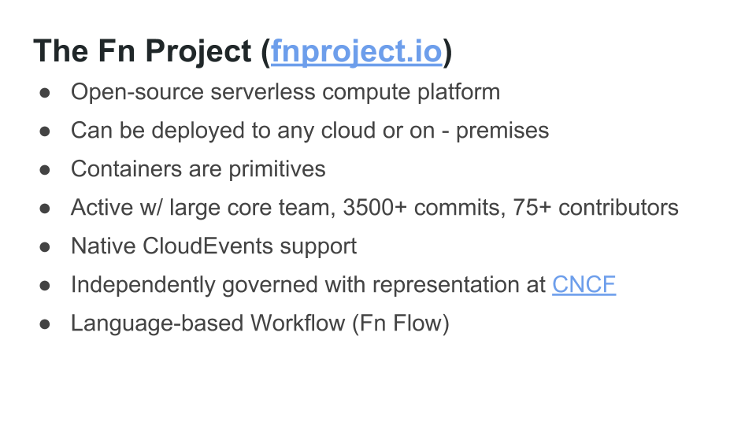
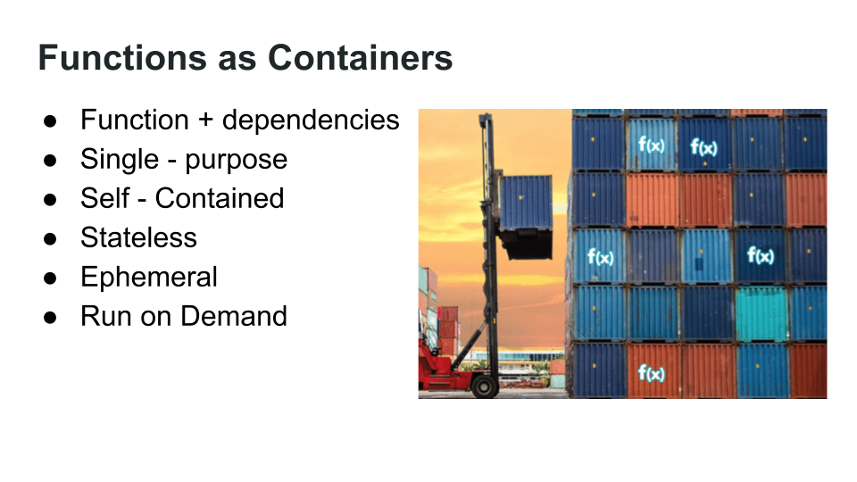
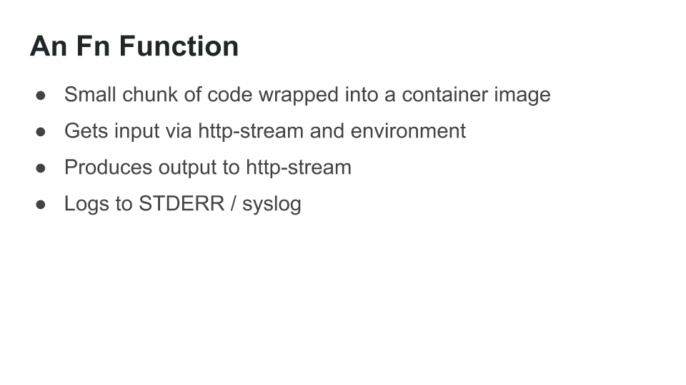
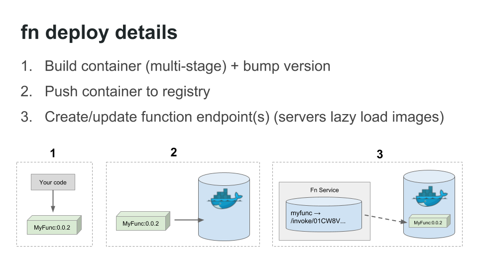

# Writing a Serverless Saga - in code

In this workshop, you're going to create a serverless implementation of the [saga pattern](https://microservices.io/patterns/data/saga.html).

You're going to build this using [Fn](https://fnproject.io/), an open source, container - native, serverless platform.

## Agenda
1.  [Introduction to Fn](#introduction)
2.  [Install Fn](#install)
3.  [Creating functions](#create)
4.  [Group functions together in apps](#group)
5.  [Orchestration with Flow](#orchestrate)
6.  [Implement a Saga with Fn and Flow](#saga)

## Pre - requisites
This workshop requires a Docker environment running on Linux (or Mac).

The assumption is that you have one of...
- Linux
- Mac
- Linux VM on Windows

...with Docker installed

## <a name="introduction"/> Introduction to Fn

[Fn](https://fnproject.io) is an open - source, container-native serverless platform.

Core written in Go, but supports functions written in any language.

## <a name="install"/> Install Fn
To install Fn, we first install the CLI and then use that to "install" the server (which actually runs as a Docker container).

To download and install the Fn CLI, follow these [instructions](http://fnproject.io/tutorials/install).

Then start the Fn server:

`fn start`

and test it.

You will need to use two ssh sessions here, one to run the server, the other to interact with it.

Or, if you prefer, you can run the server in the background by using the -d flag:

`fn start -d`.

In this case you won't see the startup text, but will see the docker container id.

If having started the server you decide to move it to the background you can stop the server with Ctrl-C or run the command `fn stop` in another window, then re-start it with `fn start -d` (If you restart it it doesn't need to download the fn server docker images, so it's much faster on subsequent starts)

If you do start the server in the background be sure to have it running when you start configuring the context.

As we're using the script to setup Fn you can skip the "Fn Manual Install" section.

Once you've got your Fn server up and running, you should be ready to create your first function.

## <a name="create"/> Creating functions
Fn uses Docker containers as function primitives.  This means that you can write functions in any language that can run in a Docker container.  You can even run a shell script as a function if you like.

However the easiest way to create a function is with the help of an FDK (Function Development Kit).  The FDK takes care of:
- reading input data
- writing output data
- writing errors
- handling repeat invocations (of the same function instance)

The last part is necessary because Fn functions are "hot" - once the function has executed, the container runs for a short (configurable) time and can be reused if the function is invoked again during that time.

If you don't use an FDK, you need to take care of these yourself.

Another point to note is that functions (and their containers) are _ephemeral_.  You shouldn't try to store any state within a function.  If you need to persist data, your function should write that to an external store of some kind.

### Using an FDK
To create a function using one of the FDKs, click on the link below to go to a tutorial for the language of your choice:

- [Go](http://fnproject.io/tutorials/Introduction/)
- [Java](http://fnproject.io/tutorials/JavaFDKIntroduction/)
- [Node.js](http://fnproject.io/tutorials/node/intro/)
- [Python](http://fnproject.io/tutorials/python/intro/)
- [Ruby](http://fnproject.io/tutorials/ruby/intro/)

If you like you can try creating functions using multiple FDKs.  They all work the same way and since the functions are isolated, your applications can be include functions written in any number of languages.  

### From a Docker image (optional)
You can also [create a function using a Docker image](http://fnproject.io/tutorials/ContainerAsFunction/).

### Using HotWrap (optional, *warning - experimental feature!!!*)
HotWrap is an experimental tool that enable you to turn any shell command into a function.  It is essentially and FDK that sends incoming events to your command as STDIN and reads the output on STDOUT.

If you're interested you can try it out [here](https://github.com/fnproject/hotwrap) (but again, it is experimental).

## <a name="group"/> Group functions together in applications (apps)

An Fn function is always deployed as part of an `application`.  When you deploy even a single function you do this within an application.

When you list deployed functions you do this by application e.g. `fn list functions myapp`.

When an app consists of multiple functions, these can be deployed in a single operation, rather than individually.

Configuration values can also be specified at the level of an application, and thus applied to all of the functions in the app, as opposed to setting the values for the individual functions.

To understand how to use apps to group functions, work through [this example](http://fnproject.io/tutorials/Apps/).

## <a name="orchestrate"/> Orchestration with Flow

As you've seen, applications can be used to organise function code, deployment and configuration.

In the vast majority of cases, performing useful work for a user will require multiple functions to be invoked.  These invocations will typically need to be coordinated to make sure that they happen in the correct sequence.  In other words you need to manage the application workflow.

Fn uses [Flow](https://github.com/fnproject/flow) as it's orchestration mechanism to manage the application workflow across multiple functions.

Flow uses a promises style API written in a normal programming language (rather than an XML or YAML dialect) to define workflows (each called a flow).

This API is currently only implemented in Java but other are implementations on the way.

Work through [Flow 101](http://fnproject.io/tutorials/Flow101/) to see a first example.

Since the flow function is written in code, you could just write this function and inline all your other operations into it, but that's probably (almost certainly) not the best idea.

The best advice is to take a "separation of concerns" approach and to use the flow purely for orchestration, and deliver the business functionality via the invoked functions.

One way of thinking about this is to use an analogy with theatre.  The **functions** required for the play might be things like `add_character`, `move_character` etc. while the **flow** that combines these functions to deliver the play is the **script**.

You can see how this approach could be used to adapt Shakespeare's comedy ___As You Like It___ for the serverless world [here](https://bitbucket.org/ewan_slater/comedy/src).

The flow (or script) is implemented by the function `as_you_like_it`.  If you inspect the source code for the class `AsYouLikeIt.java` you will see that the flow (or *script*) adds various characters to the stage, causes them to variously fall in love, wrestle, run away, and disguise themselves, causing much confusion to the characters and (hopefully) amusement for the audience.

The states of the various characters are persisted to Redis which acts as the "stage" (to stretch the theatrical analogy a bit further).

It finishes with all the main characters getting married (phew!).

Note that while the Flow is written in Java, the functions invoked by the flow can be written in any language that you choose (in this case Ruby).

One limitation that we currently have with Flow is that we need to invoke the functions by ID (rather than their name) so once the application has been deployed it is necessary to run a script (`self_configure.sh`) to configure a key - value lookup for each of the function IDs.

The `AsYouLikeIt` class then uses this to find the ID of the function it needs to invoke from the flow.

The key things to remember with Flow are:
- include the Flow library in your dependencies (pom.xml or equivalent)
- make sure
  - Fn server is running
  - Flow server is running (with API_URL pointing to the Fn server)
  - the function or app that uses Flow has COMPLETER_BASE_URL configured to point to the Flow server

The As You Like It example includes scripts to:
1.  [Start Flow](https://bitbucket.org/ewan_slater/comedy/src/3b095b03086c85b78c5f1556be9430a0150f8db4/start_flow.sh?at=master)
2.  [Configure the application]() with the function ids and the COMPLETER_BASE_URL

You will also need to run Redis and configure the REDIS_IP for the application.

## <a name="saga"/> Implement a Saga with Fn and Flow

Sadly in the real world, things rarely run so smoothly.  Often we need to execute transactions which span multiple systems which we don't own or control.

The classic approach to dealing with with such distributed transactions was to use a two - phase commit (2PC) protocol and some kind of Transaction Manager (e.g. Tuxedo) to coordinate commit and rollback operations.

However, this approach typically impacts performance, does not scale well and requires the participating systems too support the protocol.

In many cases today we are likely to be dealing with systems which we do not control and which do not support a two phase commit protocol.

The **[Saga Pattern](https://microservices.io/patterns/data/saga.html)** describes how to implement reliable _business transactions_ across multiple systems in situations where a 2PC approach is not appropriate.

The overall business transaction is the "saga".  The saga is implemented as a set of individual (system - level) transactions.  If any of these steps fail then rather than _rolling back_ the transactions in the other systems (which effectively means they have never happened), a _compensating transaction_ is applied.

So for example if part of the saga involves debiting a customer's bank account, the compensating transaction will credit the bank account by the same amount.  The customer will see both the credit and the debit transactions on their bank statement.  This is different to a _rollback_ where the customer would not see either transaction.

Flow allows us to implement the saga pattern using Fn functions: https://github.com/fnproject/tutorials/tree/master/FlowSaga

Once you've worked through this example, you could have a go at creating a saga of your own!
